# Agriculture Portal

A Web Application which will enable the farmer to sell his produce to the customer without any constraints and exploitation of the middleman, thereby he will get the profit that he deserves for his hardwork. This System encompasses varied features to help the farmer to transact efficiently and effectively.


The Agriculture Portal has three functional arms :– 

The Farmer module that can use the services which have been provided by the government. Services such as Crop Predicition, NewsFeed, Trading crops, as well as weather prediction are provided. 

The Government module that handles the inventory of the crops traded by the farmer, the details of the farmer and selling the crops to the customer at a reasonable price as well as the profit is given to the farmer without extra charges.

The customer module that allows to buy a variety of crops from the farmers at well-defined and reasonably low prices.

 
## Features

 * Two-Factor Authentication to ensure the integrity and security of information.

 * Crop Predictor using Cart Algorithm.

 * Stripe API as Payment-Gateway for the customer to purchase farm produce.

 * OpenWeatherMap API services to predict current weather.

 * OpenSSL function for Encryption and Decryption on User Credentials

 * NewsFeed

 * Multilingual support


## Installation

1. SendGrid : 
Enter your API Key in `send_otp.php`
```PHP
$mail->Username = "Username";    //Your SendGrid Username
$mail->Password = "YourAPIKEY"; 	//Your Sendgrid API KEY
$mail->SetFrom("123@gmail.com");  //Your Registered Mail from Sendgrid
```

2. SendGrid : 
Enter your API Key in `send_otp1.php`
```PHP
$mail->Username = "Username";    //Your SendGrid Username
$mail->Password = "YourAPIKEY"; //Your Sendgrid API KEY
$mail->SetFrom("123@gmail.com");  //Your Registered Mail from Sendgrid
```

3. News API :
Enter your API Key in `newsfeed.php`
```PHP
$url='http://newsapi.org/v2/everything?q=farmers&apiKey=YourAPIKEY';   //Your API KEY
```

4. OpenWeatherMap :
Enter your API Key in `upcomming days.php`
```PHP
$apiKey = "YourAPIKEY"; //Your API KEY 
```

5. Stripe payment gateway : 
Enter your API Key in `StripePayment/config.php`
```PHP
$stripeDetails = array(
	"secretKey" => "YourAPIKEY",  //Your Stripe Secret key
	"publishableKey" => "YourAPIKEY"  //Your Stripe Publishable key
	);
```


## Technologies
 * HTML5
 * PHP
 * CSS
 * Python
 * Bootstrap
 * JSON
 * Javascript
 * Curl
 * JQuery
 * MySQL


## ScreenShots

### Multi-Login Page

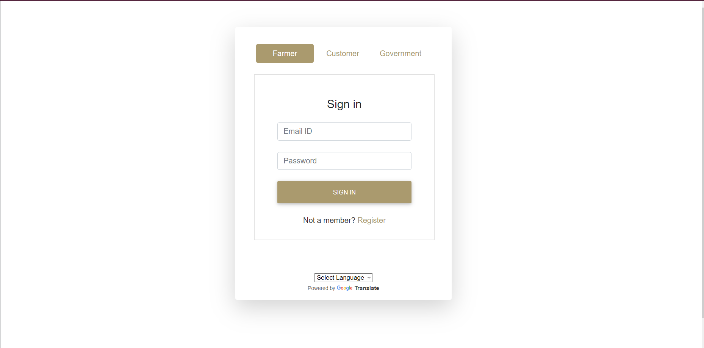


### Farmer Registration Page

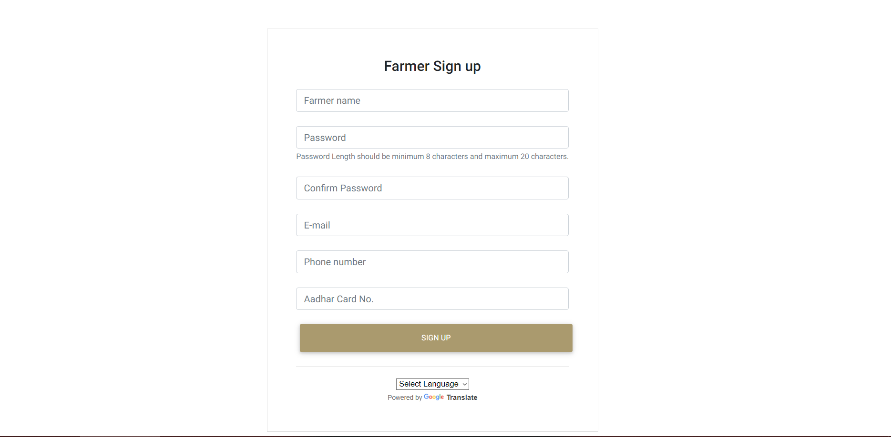


### Customer Registration Page

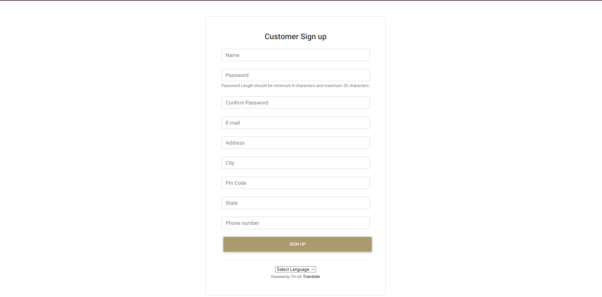


### Two-factor Verification

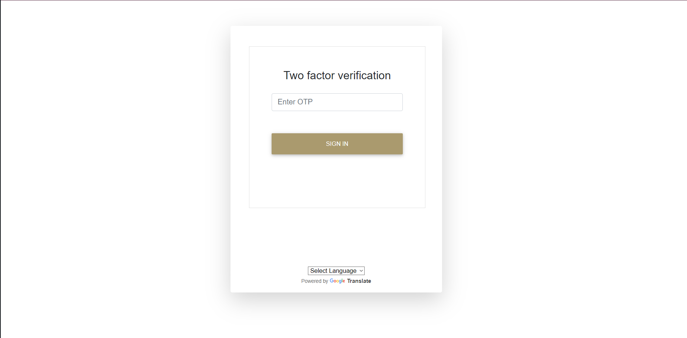


### Farmer Dashboard

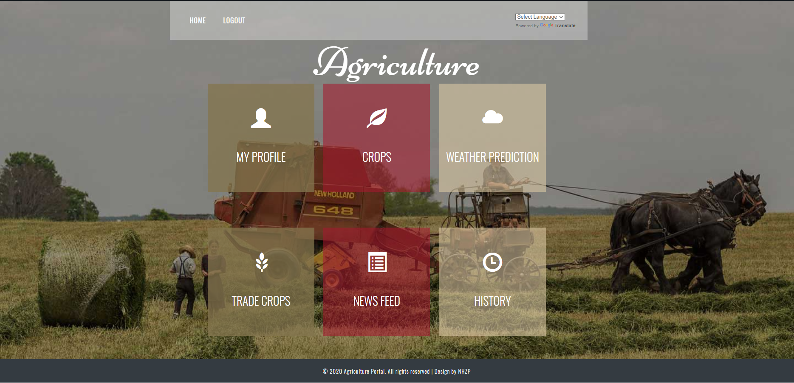


### Farmer Profile 


### Crops Predictor

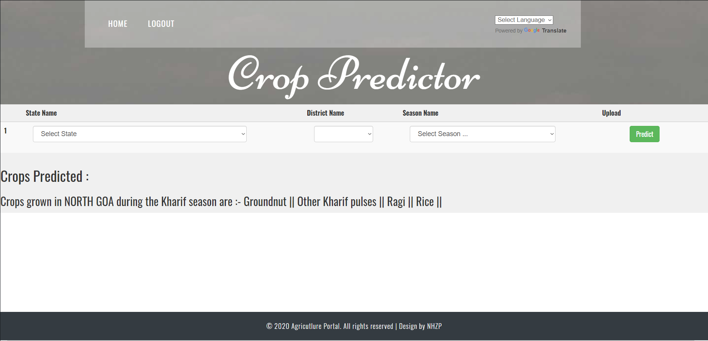


### Weather Predictor

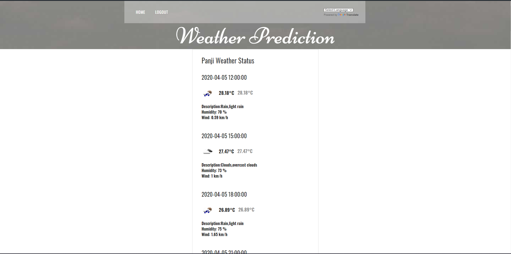


### Farmer Trade Crops

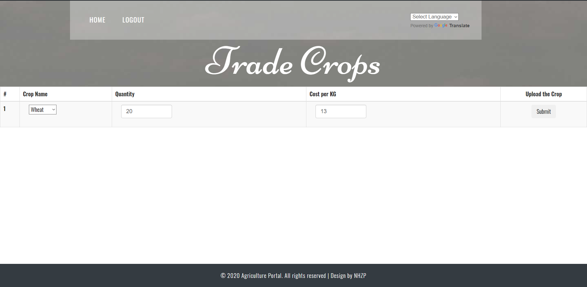


### News Feed

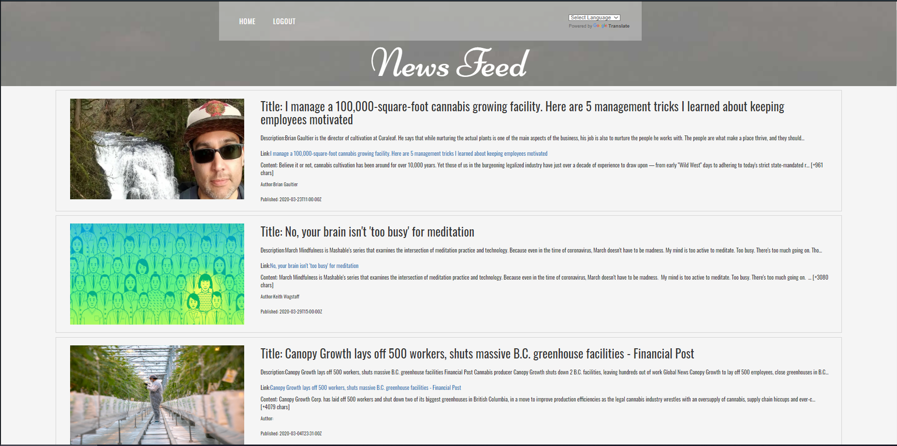


### Farmer Selling History

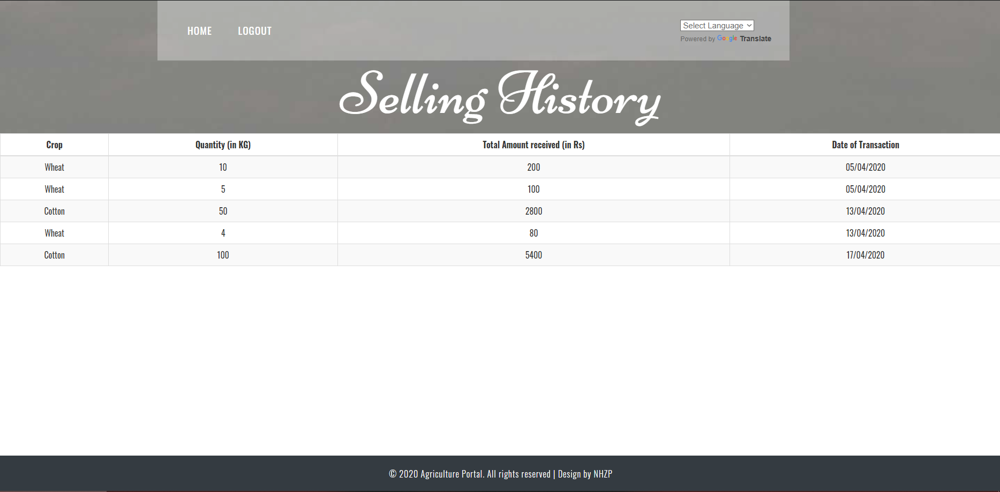


### Customer Dashboard

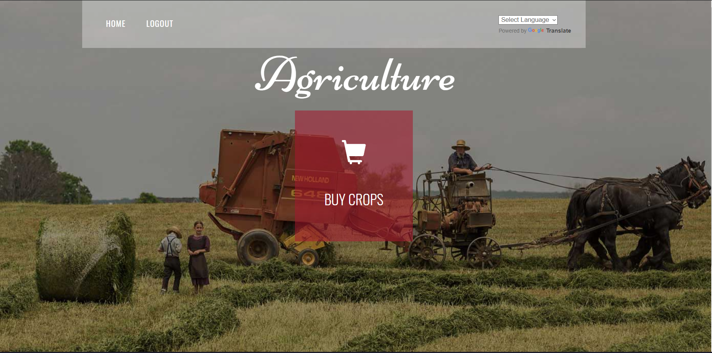


### Buy Crops & Cart

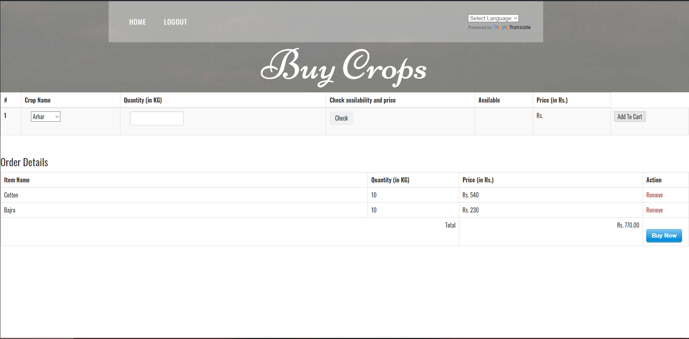


### Payment-Gateway Page

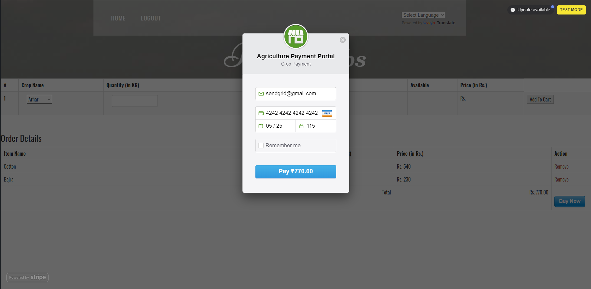


### Transaction Completed Page with Invoice

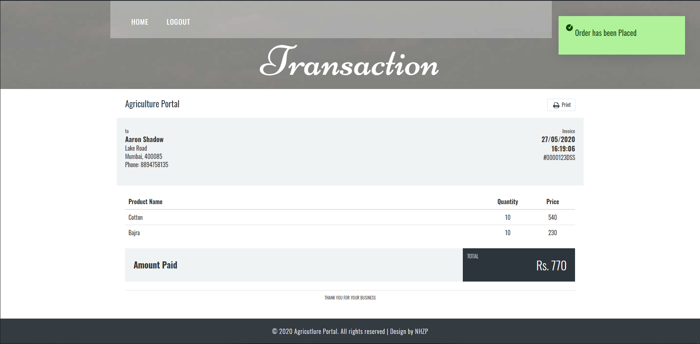


### Government Dashboard

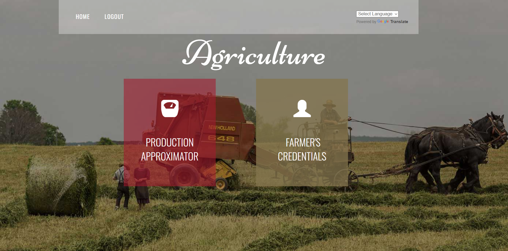


### Production Approximator

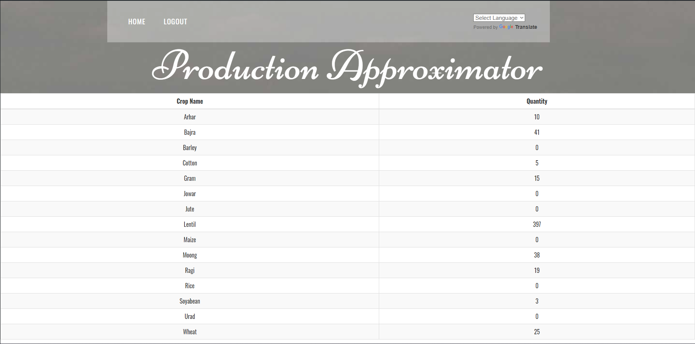


### Government-Side Farmer Details 

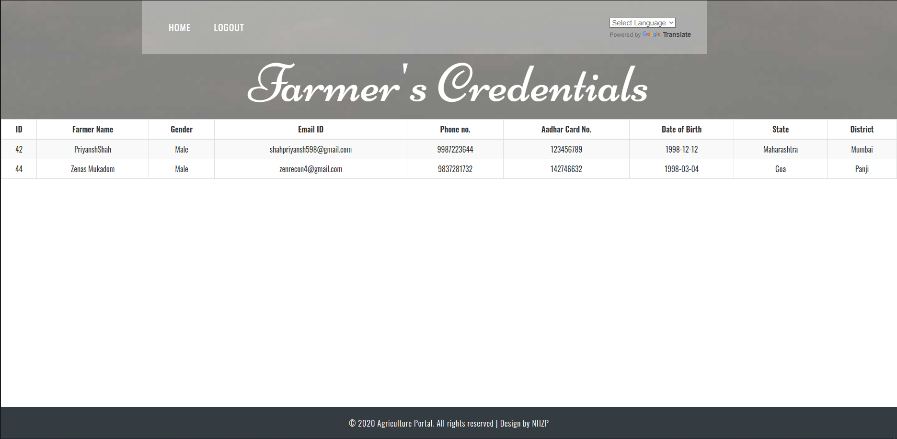


### Multilingual support in Marathi

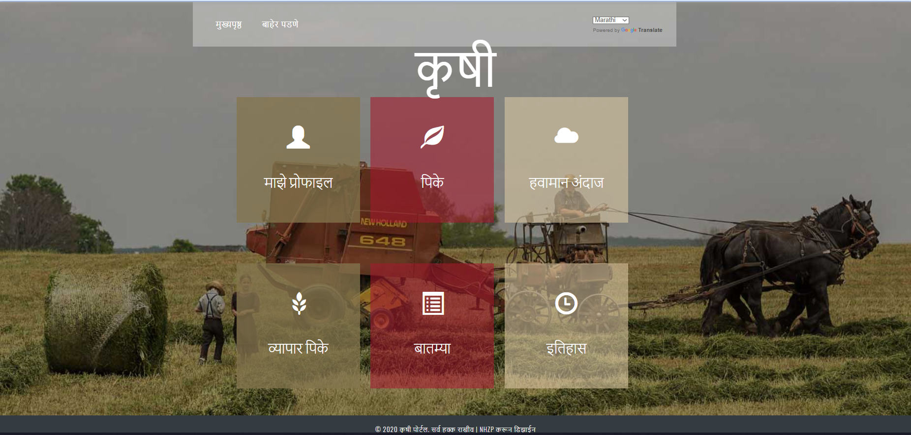
